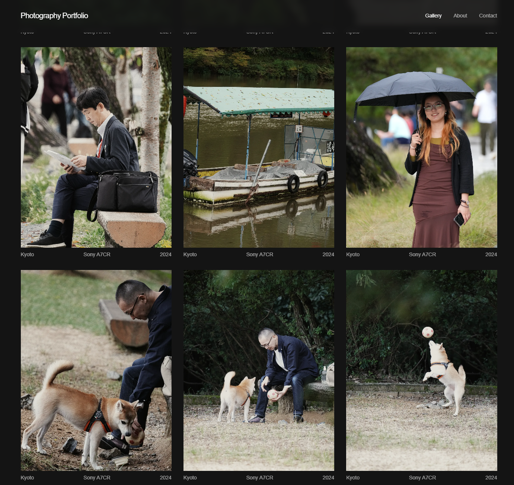
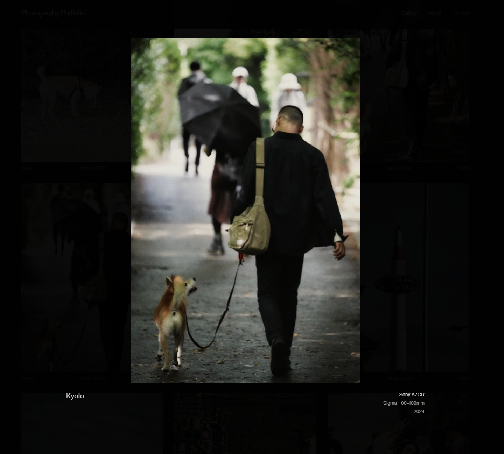

# Photography Portfolio

A modern photography portfolio website showcasing my travel and portrait photographs from Japan, Singapore, and Spain. Features an immersive gallery experience with custom animations and filterable photo collections.

## Features
- **Immersive Intro Animation**: Engaging loading sequence built with GSAP
- **Category Browsing**: View photographs organized by category
- **Advanced Filtering**: Filter photos by camera, location, year, and category
- **Image Detail View**: Examine photos with detailed metadata display
- **Responsive Design**: Optimized for desktop, tablet, and mobile devices
- **Dark Mode**: Elegant dark theme designed for photography presentation
- **Contact Form**: Built-in contact form with EmailJS integration
- **SEO Optimized**: Metadata management for better search engine visibility

## Technologies Used
- **Frontend**: Next.js, React, Tailwind CSS
- **Animation**: Framer Motion, GSAP
- **Image Optimization**: Next.js Image component
- **Form Handling**: React Hooks, EmailJS
- **Deployment**: Vercel

## Live Demo
Check out the live demo of the photography portfolio:  
[Photography Portfolio Live Demo](https://shizukadesu.com/)

## Screenshots
### Gallery View

### Photo Detail


## Installation

### Prerequisites
- Node.js (v18 or higher)
- npm or yarn

### Setup
1. Clone the repository:
```bash
git clone https://github.com/<your-username>/photography-portfolio.git
cd photography-portfolio
```

2. Install dependencies:
```bash
npm install
# or
yarn
```

3. Run the development server:
```bash
npm run dev
# or
yarn dev
```

4. Open your browser and visit http://localhost:3000.

## Project Structure
```
src/
├── app/            # Next.js app directory with page components
├── components/     # Reusable UI components
├── data/           # Data files including image collections
├── types/          # TypeScript type definitions
├── public/         # Static assets including images
└── styles/         # Global CSS styles
```

## Deployment
The application can be built for production using:
```bash
npm run build
# or
yarn build
```

## Contact
If you have any questions or feedback, feel free to reach out:
- Email: ayatgimenez@hotmail.com
- LinkedIn: [Hicham AYAT GIMENEZ](https://www.linkedin.com/in/hicham-a-9553ba28b/)
- Portfolio: [Portfolio Website](https://shizukadesu.com/)

Made with ❤️ by Shizuka